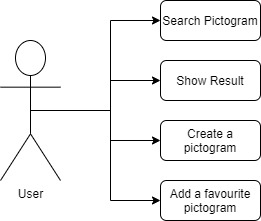
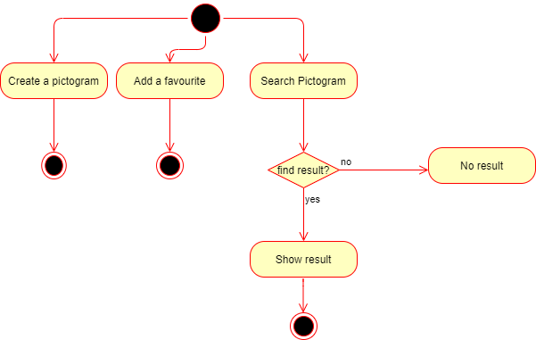
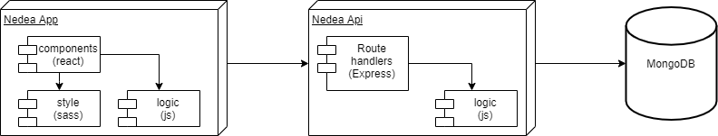
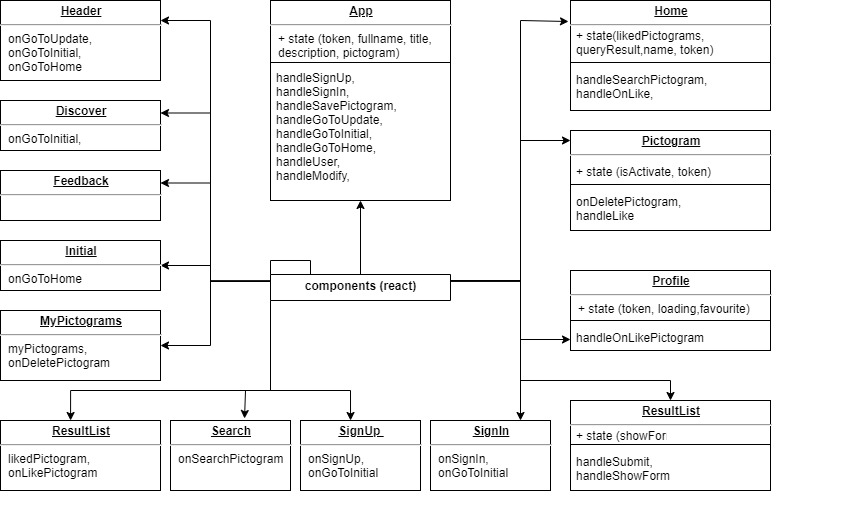

# Nedea APP

## Intro

Nedea App is a place for people who have difficulties to communicate and they do it through pictograms.

## Functional Description

### Use Cases

### Activities

You can search for pictograms, view information such as title and description, add your favorite pictograms and upload your own pictogram ...

## Technical Description

### Blocks

### Packages

#### React components

#### Logic functions

### Testing (QA)

### Technologies

### TODO

- Test in the APP
- Improve semantic
- Modify User
- Modify Pictogram

