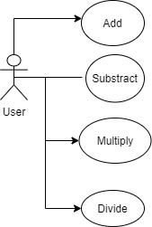
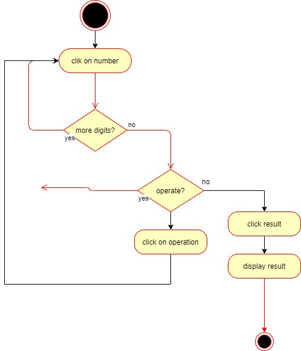

# Calculator App
This application is a basic calculator. It allows to carry out the following mathematical operations: add, subtract, multiply and divide.

## Functional Description
- index.html
The App structure
- style.css
- boliches

## Resources

[Calculator Wikipedia] (https://en.wikipedia.org/wiki/Calculator)

### Use Cases

### Activities

Operate with numbers and display result

## Technical Description

### Blocks