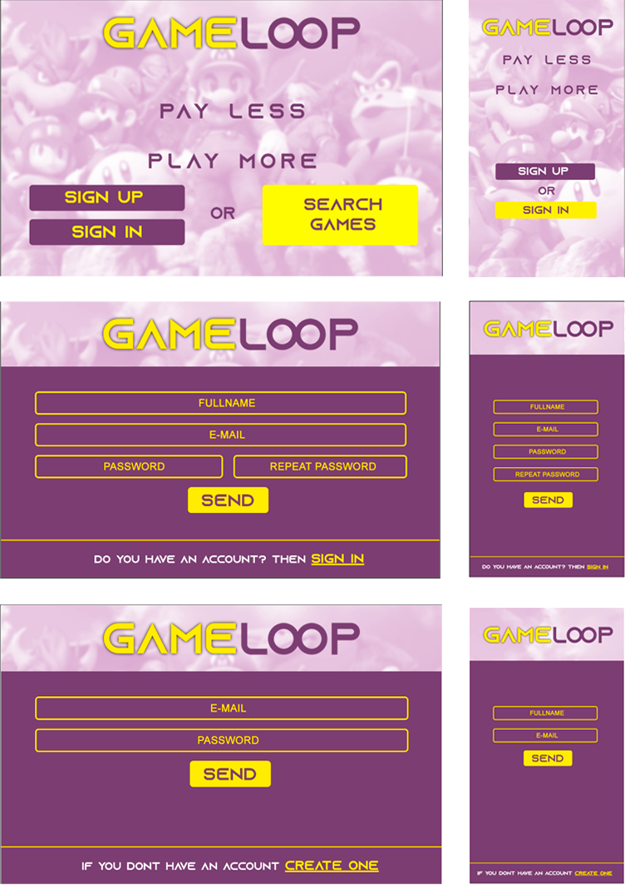
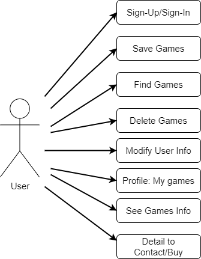
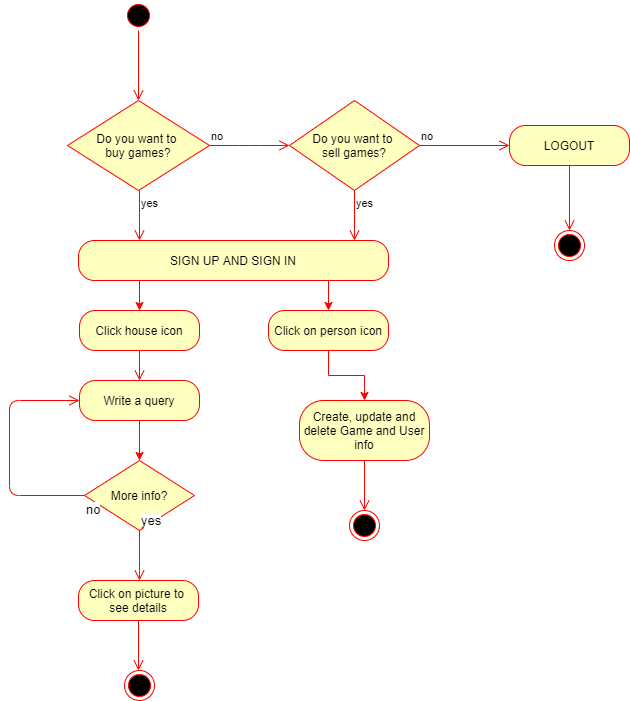
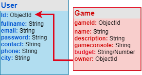
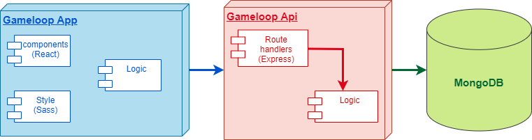
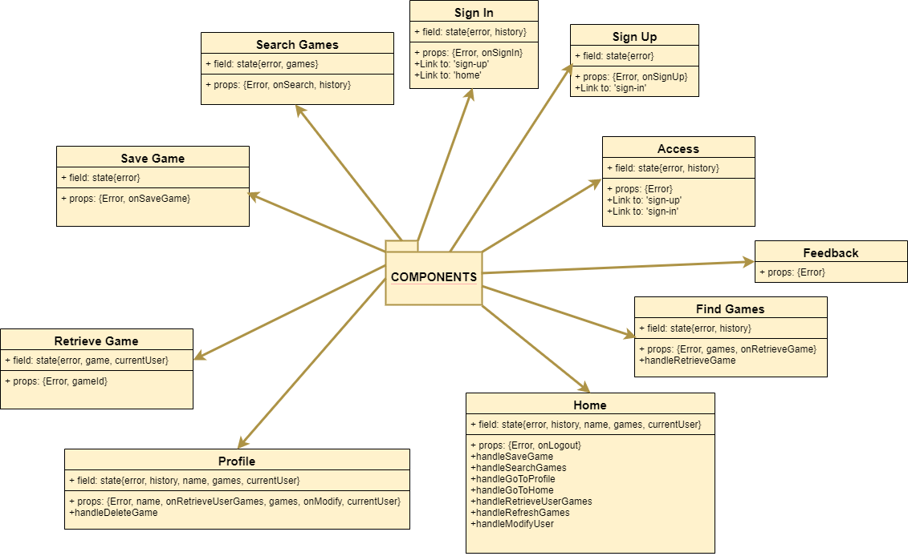
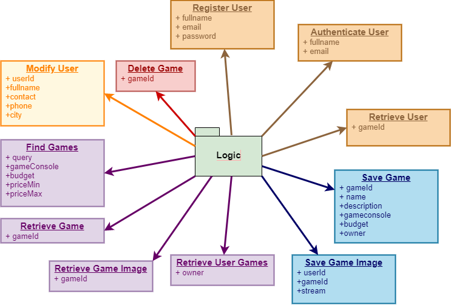
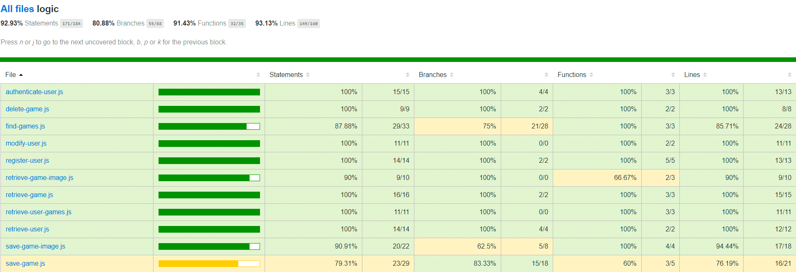
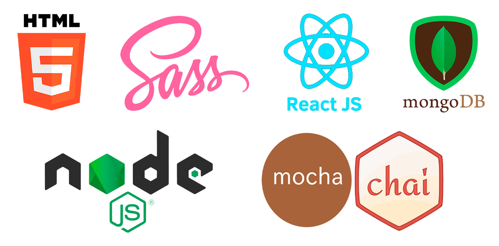

# Gameloop

## Intro

This App is an e-commerce for buy and shell second hand games. Gameloop community require your basic credentials for enjoy the experience. Find your favorite games or, if you prefer, just sell them all!

## Landing Page Layout

## Functional Description

### Use Cases

In this app gamers can search their favourite games and/or buy them. 
In the Profile section, the user can update his/her information and retrieve their own game offers. They also can delete games in this section called: ('My Games')
In the Home section the user can search games that are filtered by different querys(name, description, gameconsole, price, priceMin and/or priceMax) 

### Activities

If you are a casual gamer, just sign in, sing up,create, update and delete info about your own games. Maybe you just want to buy other games at a cheaper price, then search whatever you want

## Technical Description

### Data Model

### Blocks

### Packages

#### React Components 

#### Logic functions

### Testing

### Technologies

### TODO

- Change code to Async Await
- Modify Product 
- Likes functionality
- Change code to promises
- URL friendly
- Responsive desktop
- Improve styling
- Add map (geo)
- Add chat
- Test App logic
- Last Api Test
- Modify Product
- Bigger Populate
- Search By City
- etc...