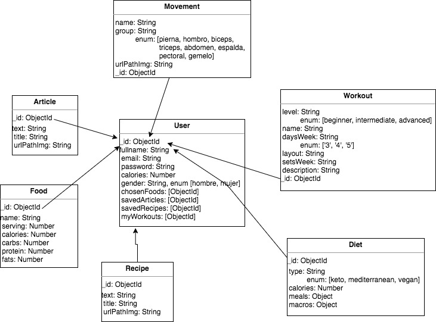

# MartachisFIT App v.0.0

The MARTACHISFIT web app is the tool to make the new health-concious user ease into a lifestyle change. We are happy of providing the source of knowledge in the shape of personalized diets, healthy recipes, a devoted blog full of interesting articles about the topic and even a food database for the user to look into his food (macronutrients and calories) to create a daily food record. This record will serve the purpose to make the user more concious about his/her food decisions on a daily basis.

## Functional Description

These are the main features that we are proud of and you will be enjoying:

- A section full of tasty and healthy recipes to make you forget about how boring is eat healthier choices.
- If you want to be more knowledgeable about everything that entails to undertake a healthy lifestyle, we will be providing you, on a weekly basis, interesting and thought-provoking articles in our blog.
- Upon registration and after getting some basic information from your end, we will calculate your daily caloric intake according your main goal.
We will use this number to offer you some diet plans that you could even change, but of course, in all cases within your caloric allotment, mind you.
- For those more interested in giving a step further and design a diet with their favourite food, we are providing a food database to search the food you enjoy more and make your own decision to add them to their daily food record and confirm on a personal profile the numbers of your choices.
- The user will be able to start a fitness journey to a better physique, adding a workout routine to the profile. He/she will have several choices depending on previous experience related to resistence training.
- The user profile will be the handy personal space for all the saved or faved recipes, articles, the food record, etc.

### Use Cases

### Activities

## Technical Description

### Blocks

### Packages

#### React components

#### Logic functions

### Data Model

### Testing (QA)

### Technologies

#### MERN Stack

### TODO

#### Code-related:
- App Testing and reach 100% in server-side.
- Watch out order, "cleanness" and semantic
- Implement react-router-dom on Home compo
- Start implementing async-await

#### App-related:
- Experience level (in the gym) input for the user
- Improve the visual aspect of the meals layout (diet component)
- Articles index creation (visual)
- Populate the food db with more items
- Watch out the images quality (some of them will be changed for self-made videos)
- Comments component for recipes and articles
- Historic weight chart on the profile with Chart.js (model below):

