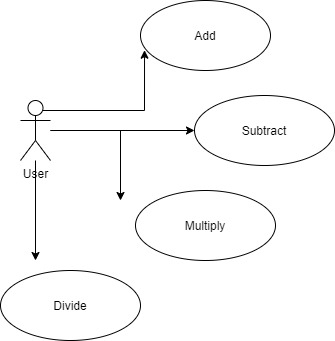
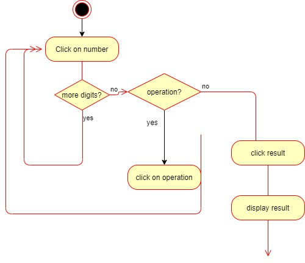
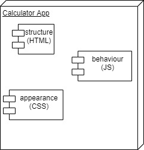

# Calulator App

## Intro

This is an online calculator to +,-,*,/

## How it works

## Functional Description

### Use Cases
 "Use Cases"

### Activities

Operate with numbers and display result.

 "Operate Activity"

## Technical Description

### Blocks

 "Blocks"

### index.html

The app structure...

### style.css

The styles...

### main.js

The main js code...

### calculate.js

The calculator logic...

## Resources

[Calculator wikipedia](https://en.wikipedia.org/wiki/Calculator)