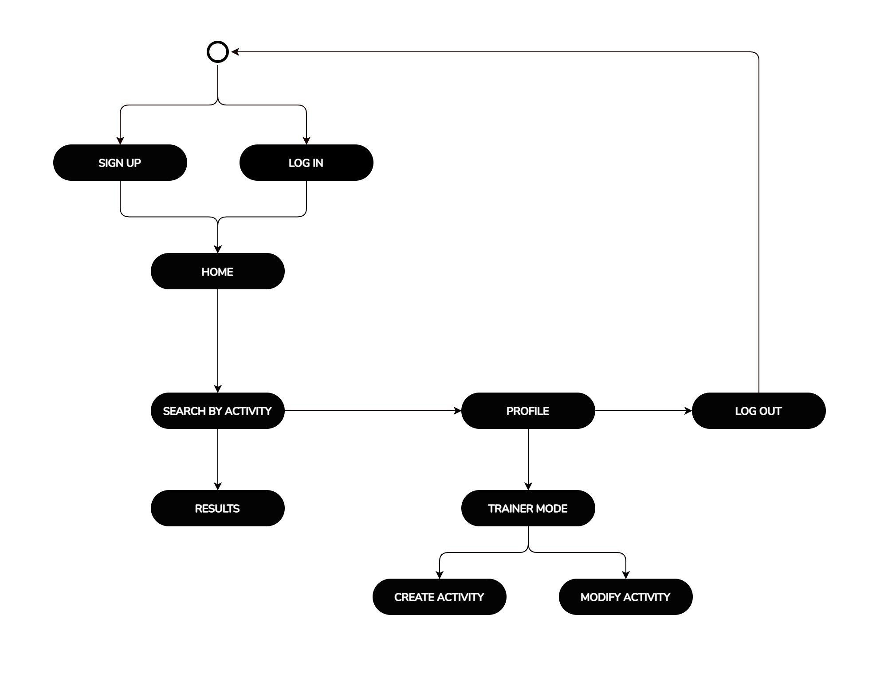
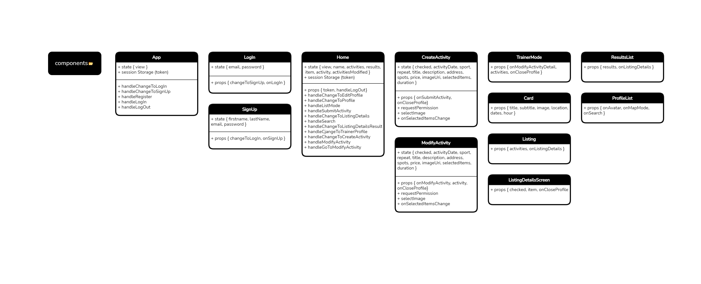

# Urban Fitness App

## Intro

Search engine for outdoor sports activities.
For trainers: Allows trainers to post the activities offered in the app.
For students: Allows students to find activities nearby.

## Functional Description

### Use Cases

### Path

### Blocks

### React Native Components

### Logic functions

### Collections

### Technologies

### TODO

- update user
- unregister user
- add react navigation
- add calendary options
- add logic attend to class
- add toggle like
- add location geocoding
- testing
