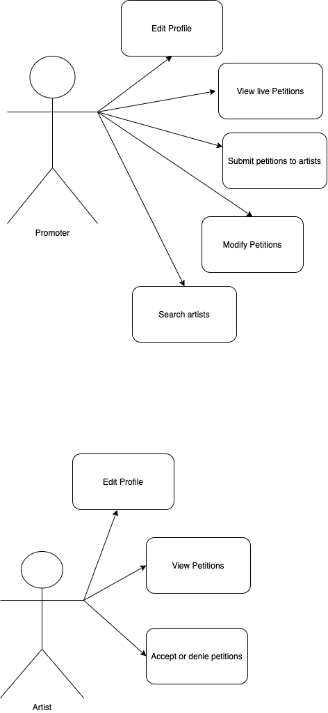
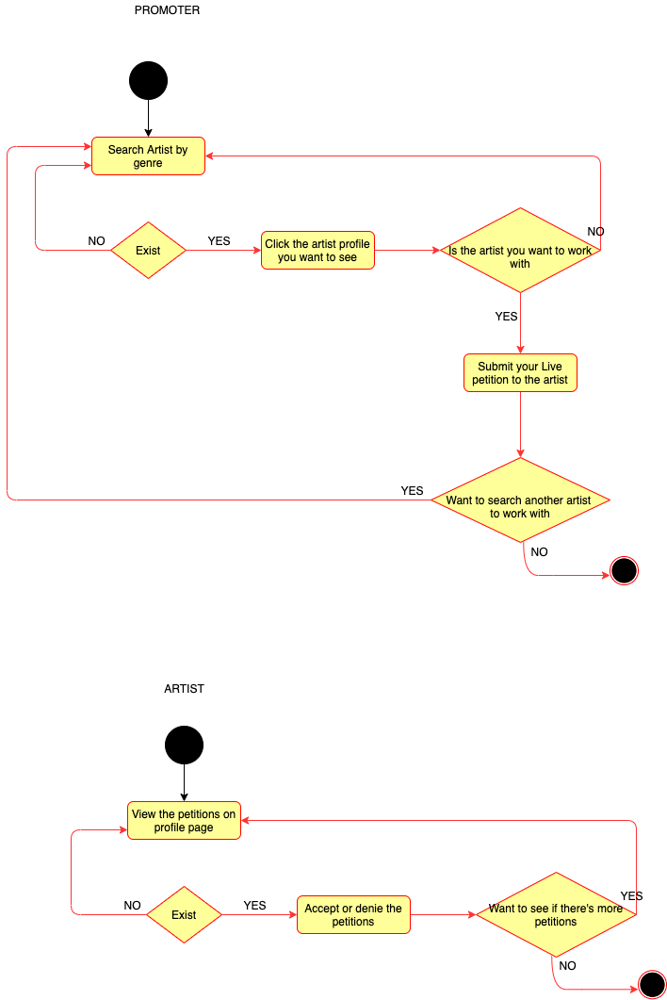
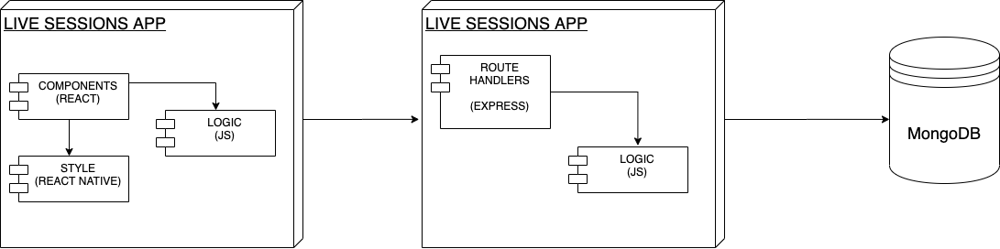
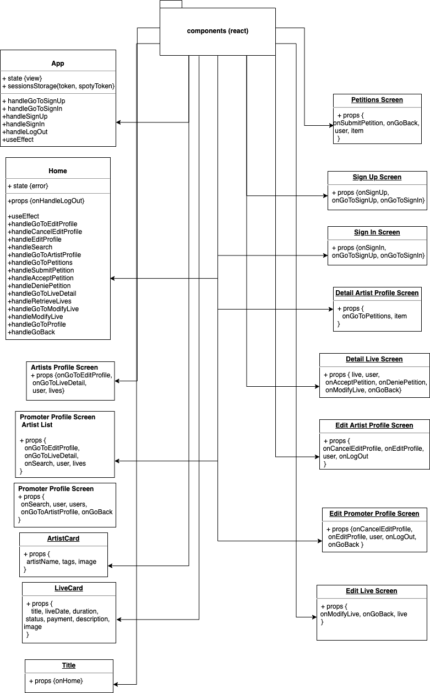
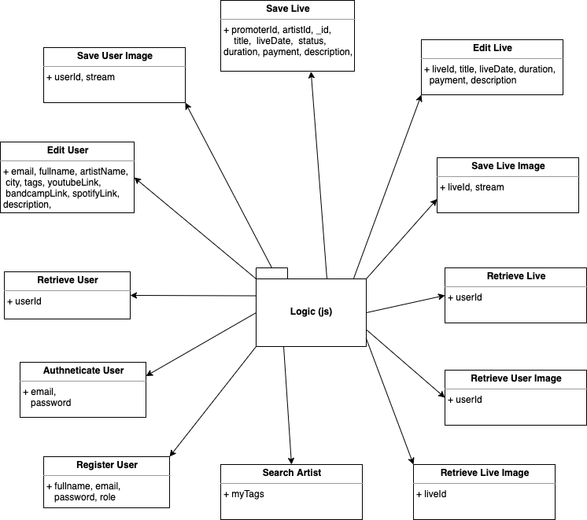
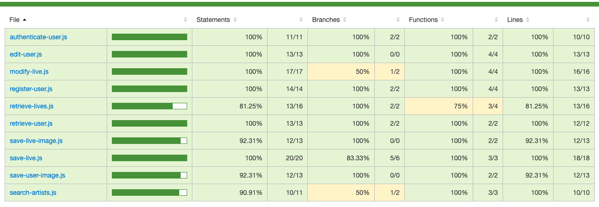

# Live Sessions

## Intro

App for promoters they can hired artists for lives sessions.

## Functional Description

### Use Cases

### Activities

Register as an artist or as a promoter and do live Sessions for the people.

Promoter: Find artists and submit petitions for live sessions
Artist: recieve petitions for live sessions, accept or denie them.

## Technical Description

### Blocks

### Packages

#### React components

#### Logic function

### Testing (QA)

### Technologies

### TODO 

- TESTING!!!!
- Add Artist Name to the cards
- like artist
- unregister user
- use better semanthic
- add chat
- add search promoter
- improve styles
