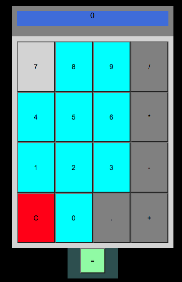

# Calculator App

## Intro

Calculate your taxes and split bills with friends quicly.

## How it works

Operations will show on display

## App structure

        ### index.html

    Calculator's structure

        ### Style.css

    Calculator looks

        ### Calculator.js

    Calculator's logic

        ### Main.js

    function of Buttons on click & display results

## Resources

[Calculator wikipedia] 

- https://en.wikipedia.org/wiki/Calculator