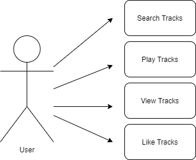
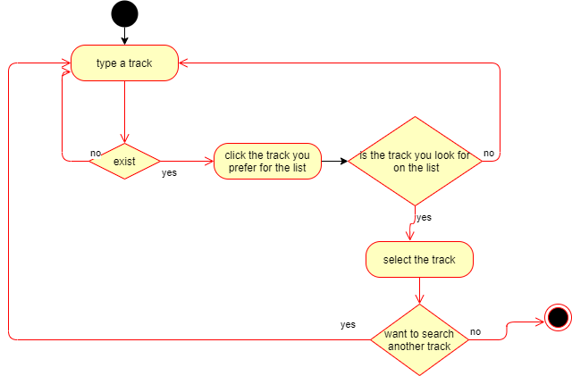
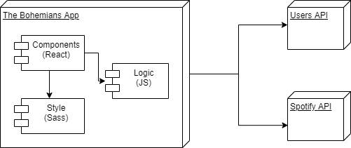
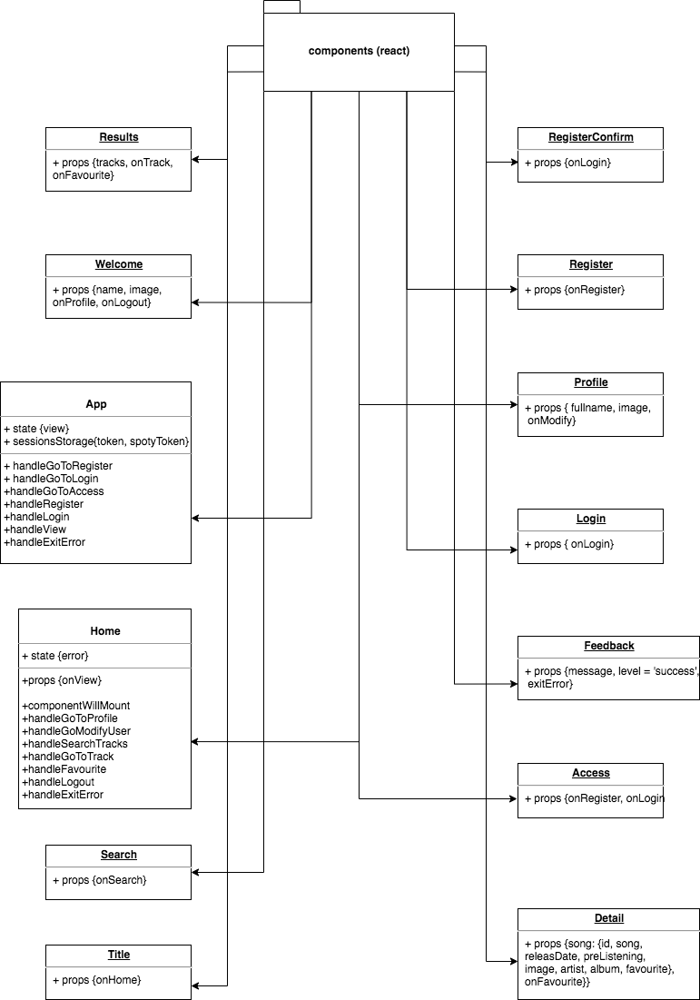
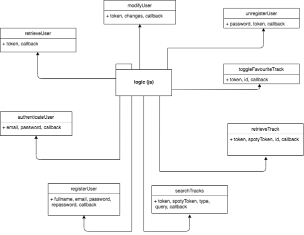
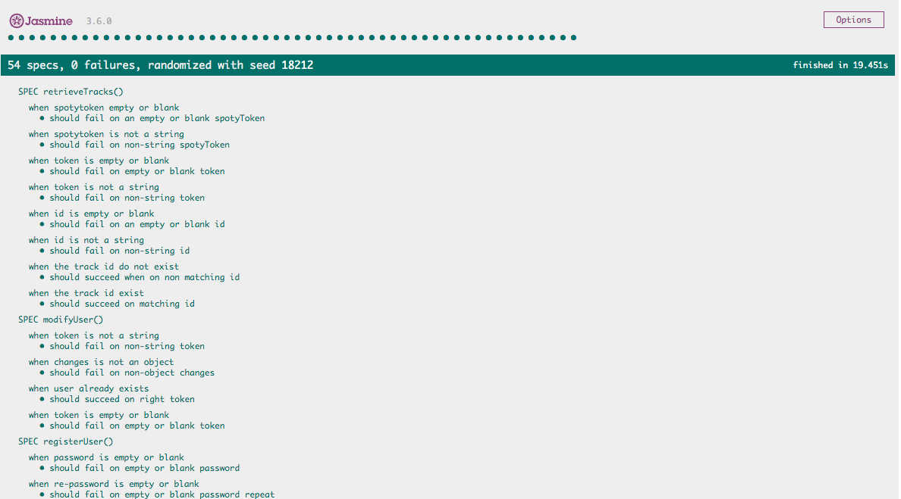

# The Bohemians

## Intro

Virtual music search that develops tracks info.

## Functional Description

### Use Cases

### Activities

Search tracks and display info about the track

## Technical Description

### Blocks

### Packages

#### React Components 

#### Logic function

### Testing (QA)

### Technologies

### TODO

- likes list
- unregister user
- ...

