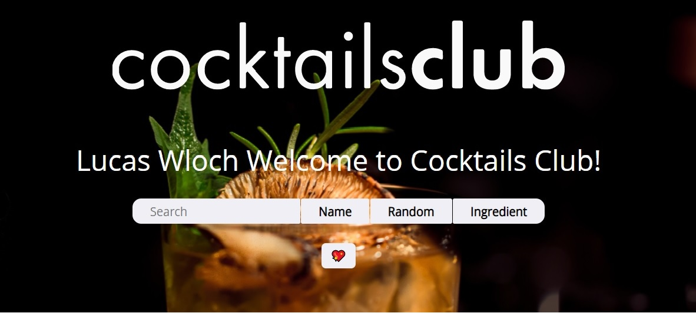
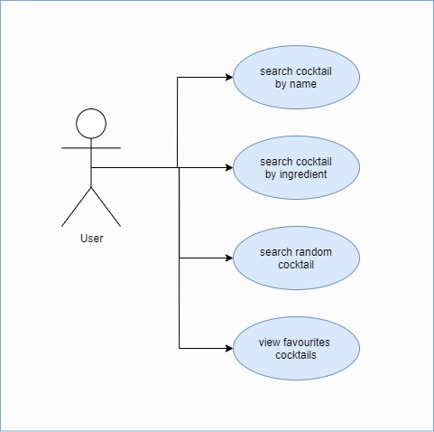
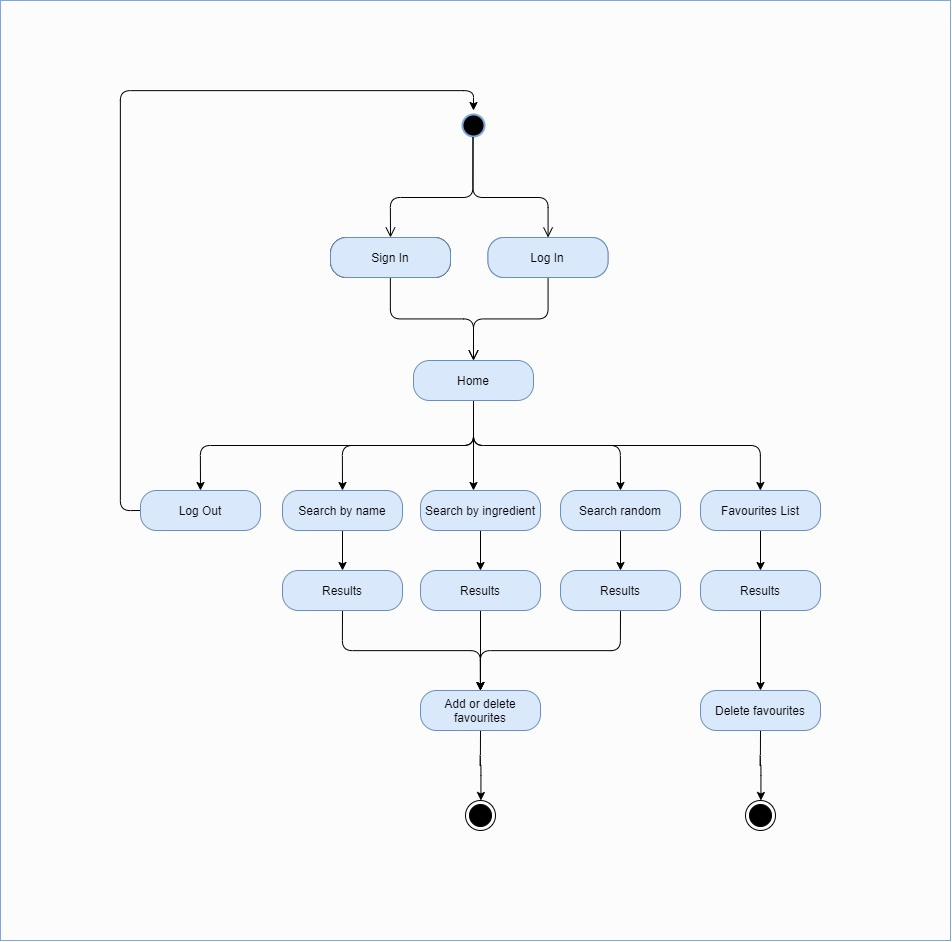
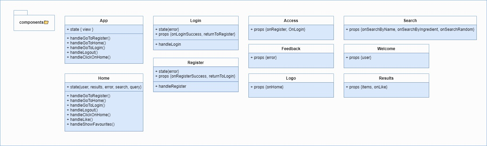
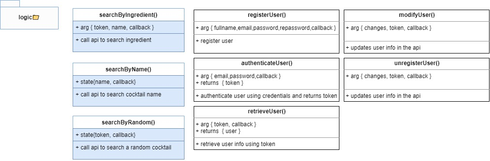
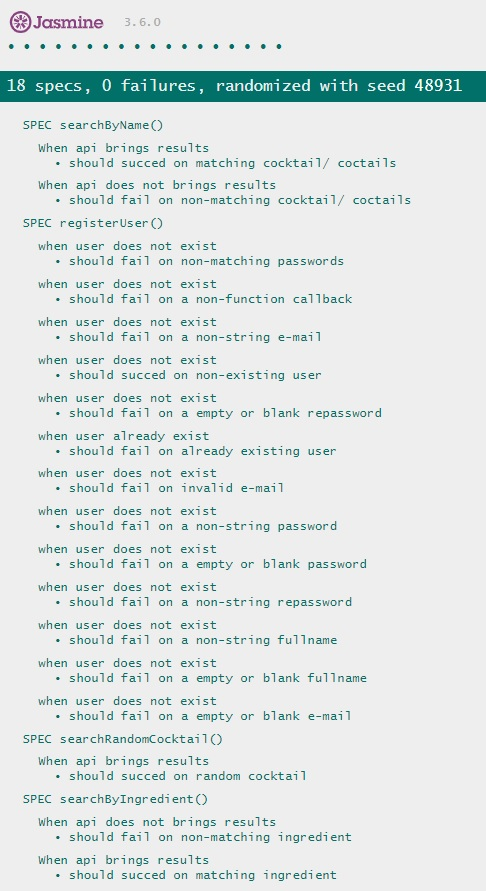

# CocktailsClub-App

## Intro

An App that looks for drinks images, instructions and ingredients

## Functional Description

### Use Cases

### Activities

search for drinks or ingredients and display results.

## Technical Description

### Blocks

### Packages

#### React components

#### Logic functions

### Testing (QA)

### Technologies

...

### TODO

- update user.
- unregister user
- add hover on the title to change color.