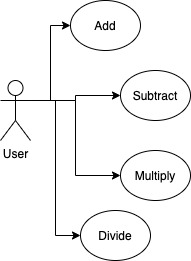
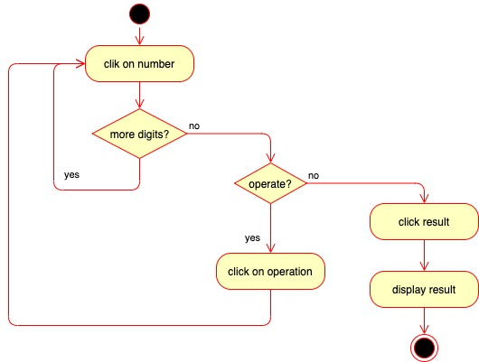
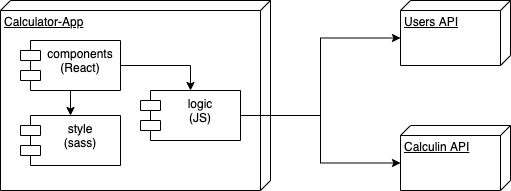
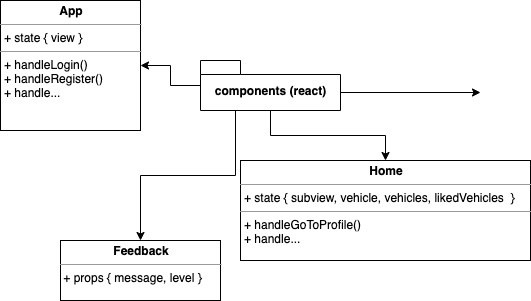
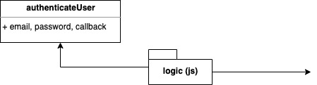
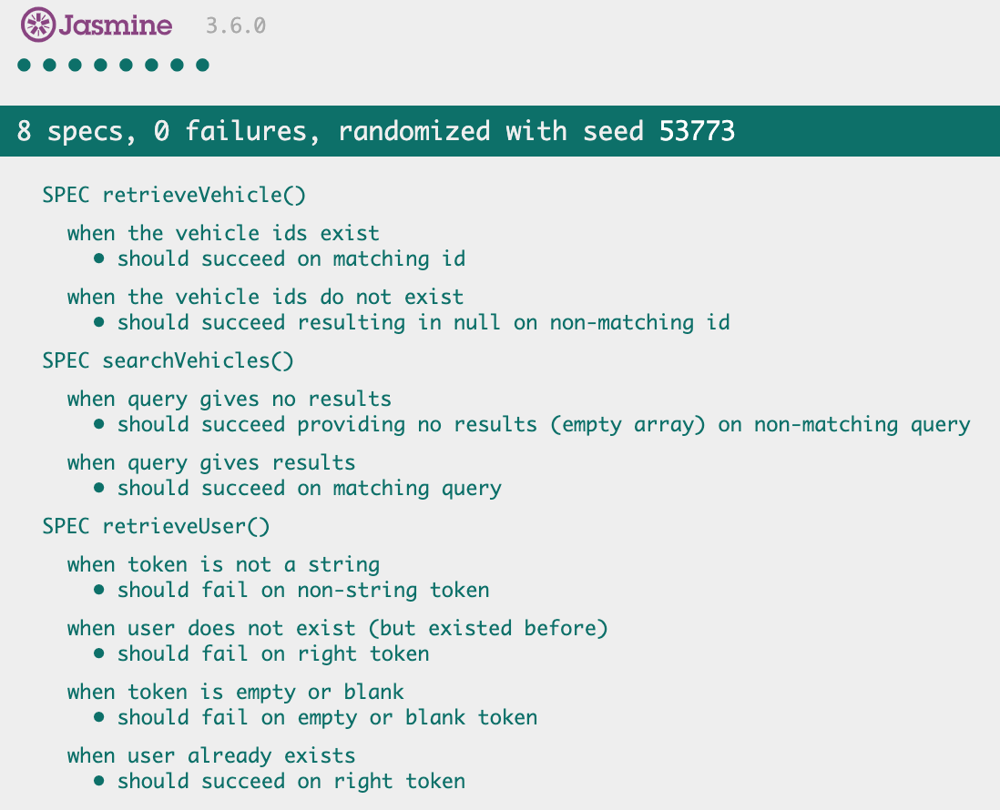

# Calulator App

## Intro

Virtual calculator that develops the following operations: +, - , /, *

## Functional Description

### Use Cases

### Activities

Operate with numbers and display result.

## Technical Description

### Blocks

### Packages

#### React components

#### Logic functions

### Testing (QA)

### Technologies

...

### TODO

- likes list
- unregister user
- ...