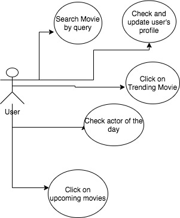
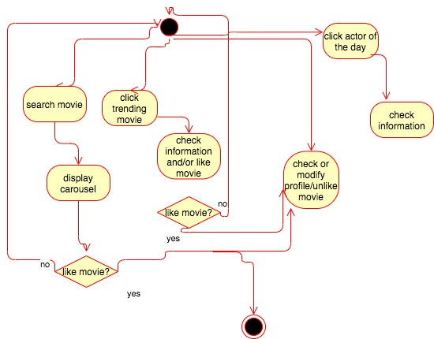
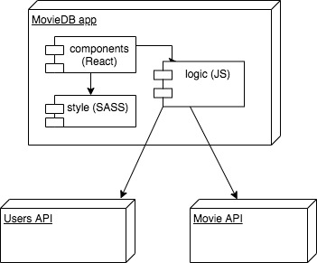
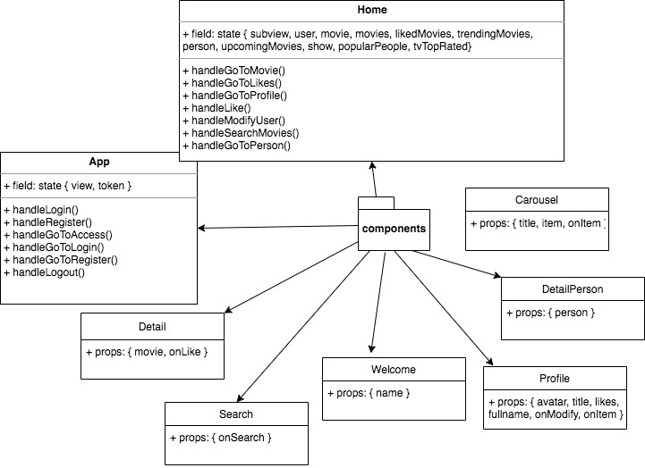
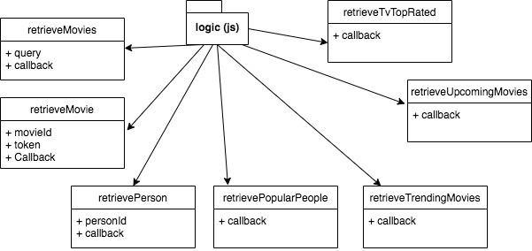
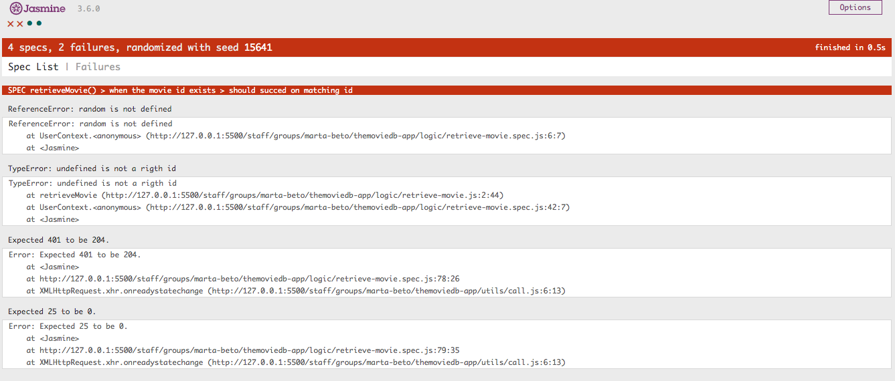

# Movies DB App

## Intro

This app is meant to serve to the user the purpose of searching movies, be at the top of the latest upcoming movies and get to know more about the most popular actors nowadays.

"The tragedy is not to die, but to be wasted", Hannibal.

## Functional Description

The main features you will be enjoying are:
- A movies search.
- A trending movies carousel to browse.
- A popular actors carousel which will be changing every day to find out more about your actors.
- The ability to like or dislike the movies you enjoy or don't.
- A personal profile with the films you liked previously and some basic information of you.

### Use Cases

### Activities

Searching movies, actors and check different information about the topic. You will be able to like any movie to check it on your personal profile aswell and have an easier access to check it later or even unlike it.

## Technical Description

The whole app is coded leveraging different languages and frameworks, such as React for the component aspect, Sass for styling and Vanilla JS to address the APIs logic and extracting the required result.
It's shown two different pilars so to speak that lies under a user's API and a movie´s API. According to the response of those APIS, we will have to handle with the logic aspect to offer the results we are looking for.
The user follows a common sign up/sign in process to properly use the app and its features fully. We rely on the users API to manage this aspect, and the main component 'App' will be taking care of this process (handleing user's inputs) until the final authentication, where the user will place himself in the second main component 'Home'.
This will be where the user will have the majority of his interactions and inputs to get the results that he/she wants.
The movie API will be the main 'actor' here and the js logic behind the scenes to offer all the information for handling.

### Blocks

### Packages

#### React components

#### Logic functions

### Testing (QA)

### Technologies

### TODO

- Embed trailer videos.
- Unregister user.
- Pay much more focus and importance to testing.
- Face TV shows logic.
- Add main actors feature inside detail card.
- More features in profile.
- Get the hang of the activity diagram in prospective projects and even be more accurate with the documentation xD

