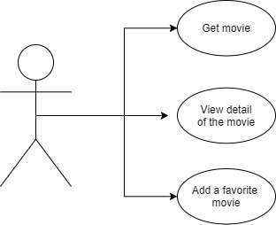
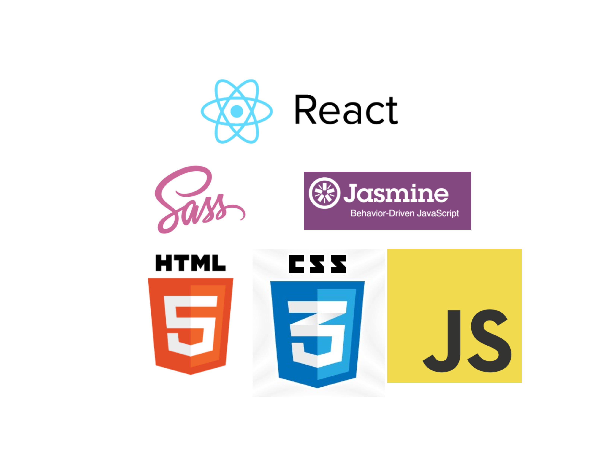

# Movie APP

## Intro

Movie App is a unique place to find information about movies, relax and enjoy.

## Functional Description

### Use Cases

### Activities

You can search for movies, view information such as actors, duration, year, description, add your favorite movies and much more...

## Technical Description

### Blocks

### Packages

#### React components

#### Logic functions

### Testing (QA)

### Technologies

...

### TODO

- Be able to add comments on the movie
- Delete user from profile
- Delete from profile
- Add more test (Jasmine)

### The team "The movie records"

Special thanks: (Simon, Henry, Manu & and to all the colleagues from the first Lets Coder promotion)
