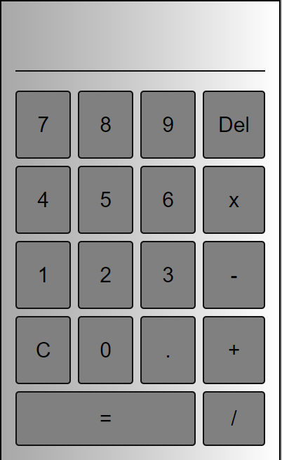
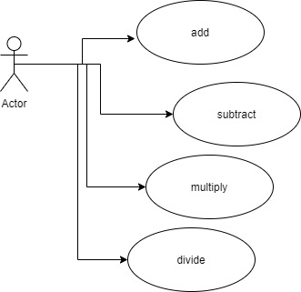
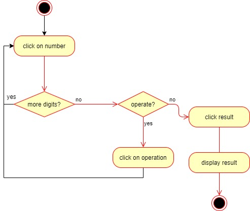
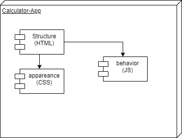

# Calculator App
## INTRODUCTION

This is a basic web calculator app with all the normal functions.
You can do additions, subtractions, multiplications y divisions.
### Project Documents

## How It Works

The Calculator is composed by buttons that trigger different instructions to make the browser do the computations and show the results 

## Functional Description
### Use Cases

### Activities

## Technical Description
### Blocks

...

It has four main components 
- index.html ESTRUCTURE

- styles.css DESING
- main.js MAIN INSTRUCTIONS
- calculate.js FUNCTIONS

## resources
[link to google](google.com)