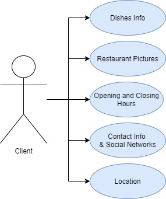
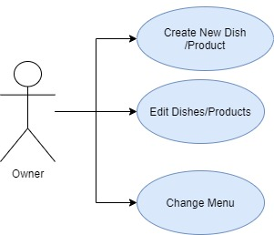
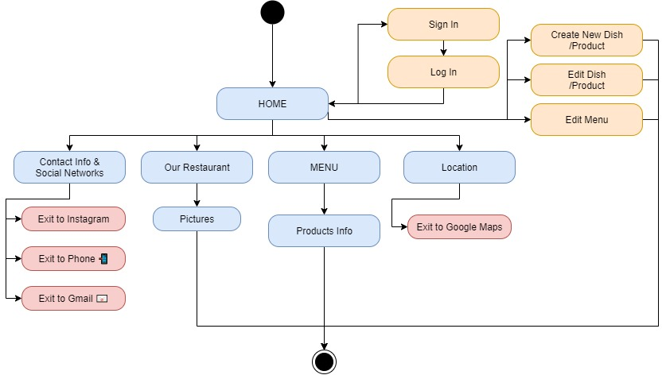
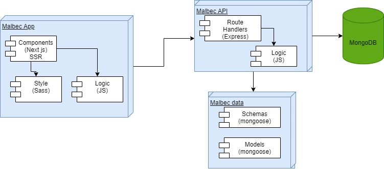
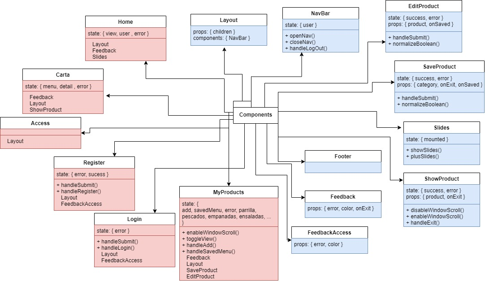
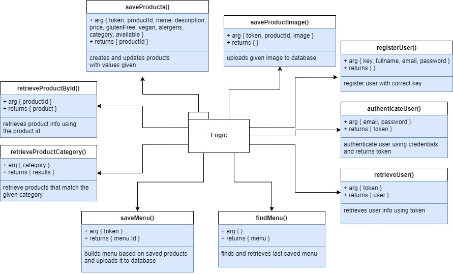
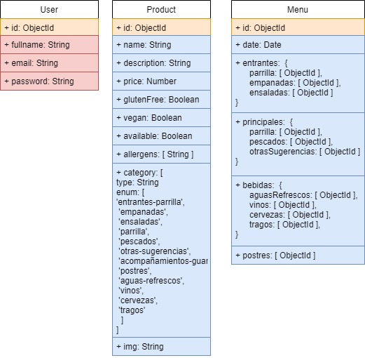
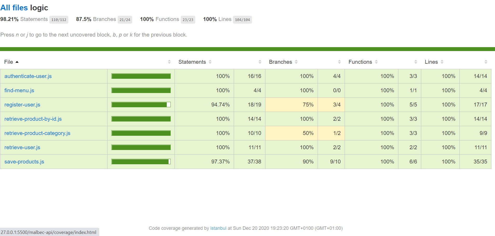
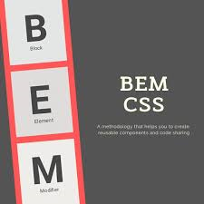

# Malbec App v.0.0

Malbec is the web site for the "Malbec Asador Argentino /  Malbec Argentine Stakehouse" restaurant,
it also includes an admin section for the owner wich allows them to update information regarding the dishes.
Our objetive is to offer the clients information about the restaurant dishes, openning and closing hours, location and more in an simplistic way,

## Functional Description

The Malbec website shows:
- info on the available dishes
- opening and closing hours
- reservation info
- restaurant's location 

### Use Cases
#### Client :

#### Owner :

### Activities

## Technical Description

### Blocks

### Packages

#### React components

#### Logic functions

### Data Model

### Testing (QA)

### Technologies

#### MERN Stack

#### BEM

#### SASS

#### Json Web Token

### TODO

- styles for desktop version.
- improve pictures and add videos.
- add analitycs.
- add basic cart so the clients can choose what they're ordering while navigating the menu.
- add section for admins to modify menu structure.
 
