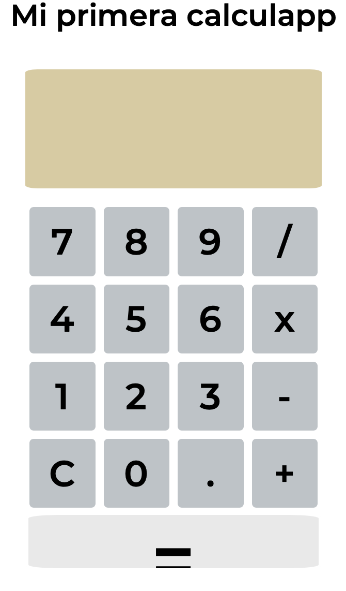
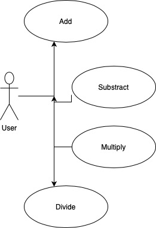

# Calculator App

My first Calculator App using HTML, CSS and JavaScript

This is a simple calculator made using HTML, CSS Flex and Grid and JavaScript. 

My first calculator app is only able to perform basic math operations. addition, substraction, multiplication and division. 

## Technical Description: 

- index.html 
- styles.css
- main.js 

## Resources 

[Calculator Wikipedia] (https://en.wikipedia.org/wiki/Calculator)

## Functional description 

### Use Cases

### Activities 

### Blocks 

