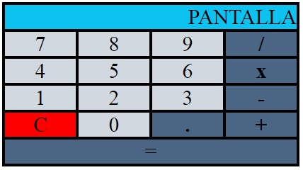

# Calculator App

## Introducción
A continuación se presenta el proyecto CALCULATOR, en el que se especificarán todas las opciones que permite la aplicación así como la manera de interactuar el usuario con la misma. Se la aplicaión se desarrolla utilizando html, css y JavaScript.

## CÓMO FUNCIONA:
- Abrir la aplicación.
- Seleccionar los dígitos numéricos con los que se desee operar.
- Seleccionar los dígitos de operación que se dessee realizar.
- Presionar la tecla "=" para obtener el resultado en el display.
- Pulsar la tecla "C" para borrar el contenido de la pantalla y poder ejecutar de nuevo otra operación.
Pueden encadenarse varias operaciones seguidas.

## DESCRIPCIÓN TÉCNICA

### - index.html

### - style.css

### - main.js