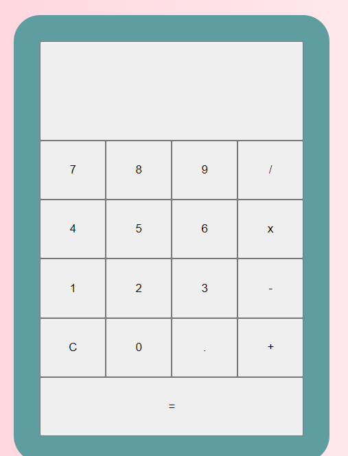

# Calculator App

It is a calculator that it can be used by everyone who wants to do an operation. 

## How it works
The user who wants to use it must click on a number, after clik again on the operation that has to be done and finally the second number. The user must push the button equal to know the result of the operation. Also it has a button, for reset the calculator.
## Technical Description 
### What Operations can do?
- Add
- Substract
- Divide
- Multiply
## Index.html
The app structure is rectangle that inside, it has a structure of buttons that corresponds with numbers and operations. Above the buttons, there is a place in which area, the numbers will appear as soon as you press the botton.