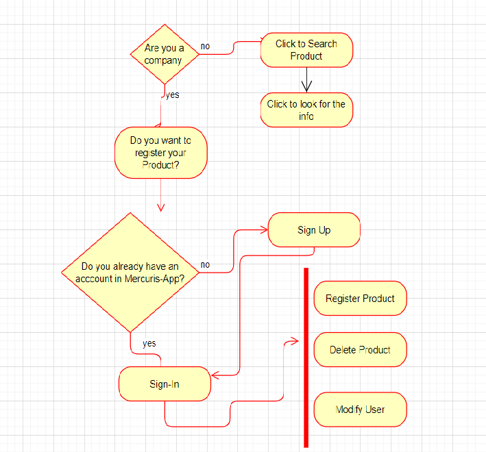

[github](https://github.com/Marta108) 

# Mercuris

## Intro

Mercuris is an app based in marketplace framework, which it main aim is raising the products of the minor-commerce, that they want to expand their products and let the people know in order to raise the company. The other advantege that the app has is that the people can find its products and get in contact with them.

## Functional Description

### Use Cases

With this app, companys and minor commerce  has the opportunity to raose the products and also this products, are going to be searched by the people. Those that are interested on the specific product can get in contact with the company. The Company can register all the products that they want in the Registration Product section. Also, the can search they product in case thay the want to delete the product. It also has a Profile Section if they want to update their company details

### Activities

If you want to support the minor commerce, go to the searching part and look for your favourite product. In case that you want to expand your product, sign up and register it

# Technical Description

## Blocks

## React Components

## Logic

## Testing

## Technologies

## TODO
- Testing
- Modify Product
- Introduce second role, in which the user can register itself
- Responsive
- Add GEO
- Pasarela de pago