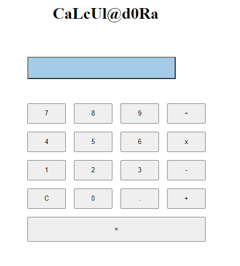

# Calculator App    

specs. for calculator app

## How it works

it displays result for differents operations.

### The structure
- HTML
the app structure in terms of HTML is based on the head, and the body, which is split in:
 *16 buttons 
      ->numbers from 0 to 9
      ->operations symbol
      ->equal symbol
 *1 display where result is displayed
- CSS
- JAVASCRIPT

