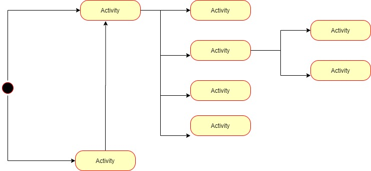

# Huertea App v.0.0

Huertea is an app that facilitates a new way of buying food products. huertea helps vegetable and fruit producers from orchards to sell their surplus. Huertea helps consumers buy organic products. This is our mission: that food is produced in conditions that respect the environment. And that these products are accessible to responsible consumers.

## Functional Description

These are the main features of our application:

- offers a place to offer products to garden owners.

- offers information to users on how to buy those products.

- offers the possibility to add or delete offers for garden products.

- offers information on the products on offer.

### Use Cases

### Activities

### Blocks

#### React components

#### Logic functions

### Data Model

### Testing (QA)

### TODO

- Let users modify users
- Geolocalitation of offers
- Chat