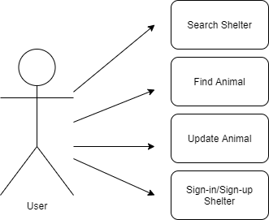
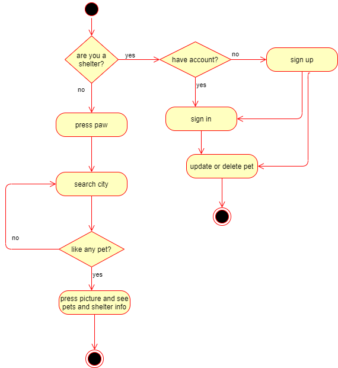

# AdogtApp

## Intro

This APP provides you information about the closest shelters and shows you the pets available to adopt

## Functional Description

### Use Cases

### Activities

Search shelters and find a pet, and if you are a shelter sign in & sing up, update and delete info about the animals.

## Technical Description

### Blocks

### Packages

#### React Components 

#### Logic function

### Testing (QA)

### Technologies

### TODO

- ...
