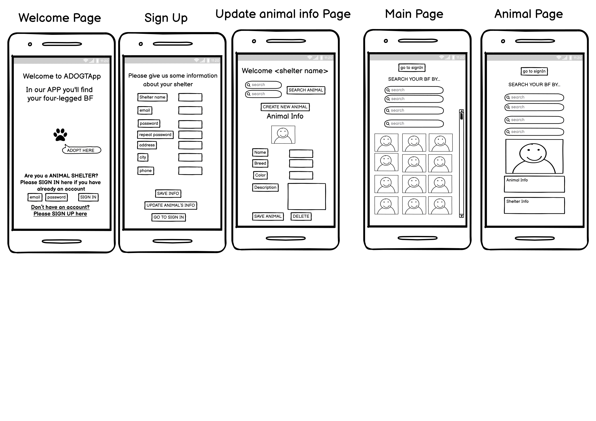
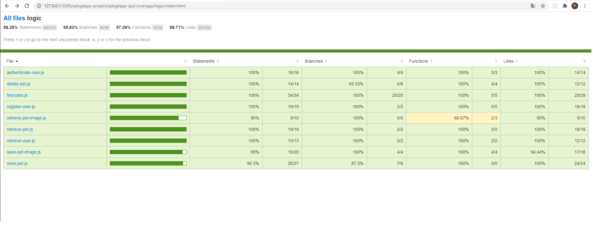

# AdogtApp

## Intro

This APP gives you the oportunity to find the pets available to adopt, it only can be shelter pets. Here is not possible to sell or buy any pet. This app was made to give visibility to shelters.

## Mockup

## Functional Description

### Use Cases

In this app the shelters can register and introduce information about the pets, and also, they can modify and delete this info.
The people that want to addopt can search by some different queries, queries about the shelter and another ones about the pet, for instance, shelter´s city or pet´s breed.
Onces they found the pet they liked they can click the picture and see more info about the pet and all the relevant information about the shelter, phone, city,...

### Activities

If you are a shelter sign in & sing up,create, update and delete info about the animals. And if you want to find a pet, you can use the queries to find the pet you are looking for.

## Technical Description

### Collections

### Blocks

### Packages

#### React Components 

#### Logic function

### Testing

### Technologies

### TODO

- change code to Async Await
- Register for users than want to addopt
- Create profile
- Likes
- Change to Promisse App part
- URL friendly
- Responsive desktop
