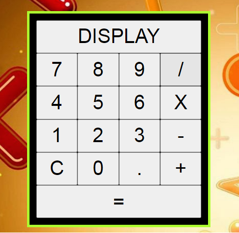
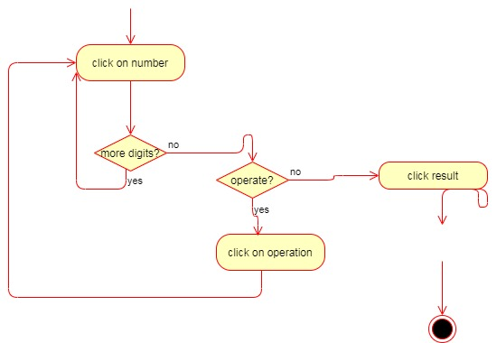
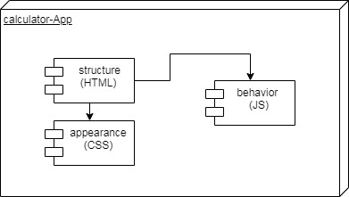

# Calculator App

## Intro

This is a small Calculator app, which can be used to make additions, multiplications,... on the display you will see the result of your operation.

## How it works

It´s really easy, you only have to press the number you want to add, multiply,.. and press the operation you would like to make add the other number and press the symbol "="

## Technical Description

### Blocks

### index.html

The app structure appears in this file, 

### style.css
### main.js
### calculate.js

## Resources

[Calculator wikipedia]("https://en.wikipedia.org/wiki/Calculator")
