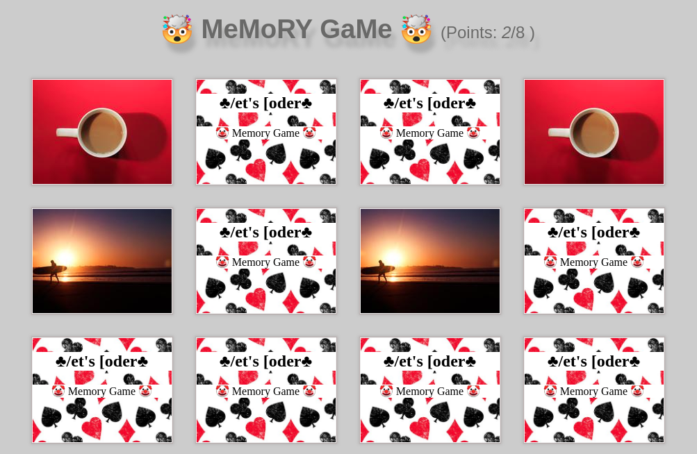

# Matching pairs game

## Intro

Memory game that consists of finding out where the pair of a specific card is.

## How it works

A player chooses two cards, if the two he chose are equal, he keeps them with him and has the right to choose another two; If the two cards he chose are different, he places them face down again in the same place and tries to remember which cards they were, giving the turn to another player.

## Technical Description

Application made using html, css and javascript

## Resources

[Matching pairs wikipedia](https://en.wikipedia.org/wiki/Matching_game)

