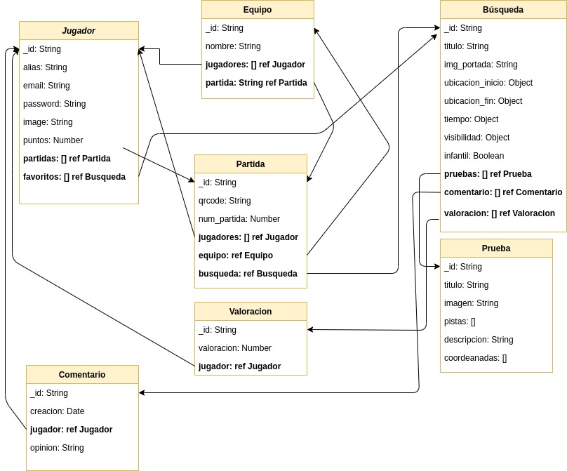

# 🕵️ GEOGIN (la búsqueda del QR) v0.0.0 🕵️

## 🔍 Description

Geogin es un juego estilo "la búsqueda del tesoro" pero en este caso lo que deberemos encontrar
son QRs que estarán escondidos y mediante una localización no exacta y una serie de explicaciones y pistas, deberemos ser capaces de encontrarlos.

El juego nos permite crear nuevas búsquedas que a posteriori podremos compartir con la comunidad de Geogin, y también tendremos la posibilidad de participar en búsquedas creadas por otros jugadores.

Durante la partida existirán dos roles, el del "organizador", que será la persona encargada de crear la partida y esconder los QRs en los sitios establecidos y el rol del "jugador" que serán los participantes de la búsqueda.

El juego transcurrirá en un tiempo limitado, que podremos configurar al crear la búsqueda y se podrá jugar tanto por equipos como de forma individual.

El ganador de la búsqueda será el jugador que encuentre primero todos los Qrs escondidos o si finaliza el juego antes por el tiempo, habrá ganado el jugador que obtenga más puntos.

Por cada prueba que superemos en las búsquedas el jugador obtendrá 10 puntos y por cada pista que utilicemos se nos restaran 2 puntos.

## 🔍 Data modeling

