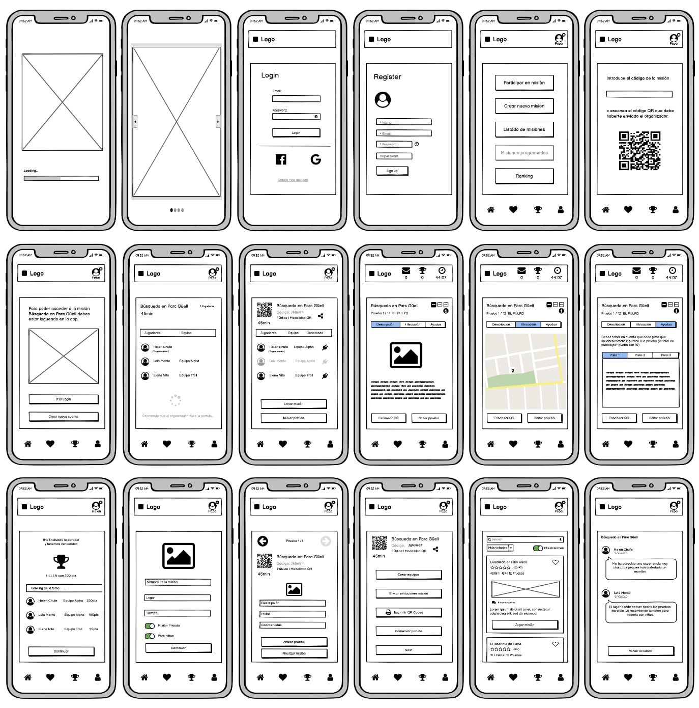
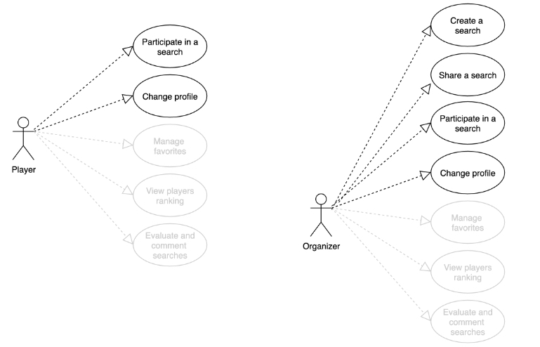
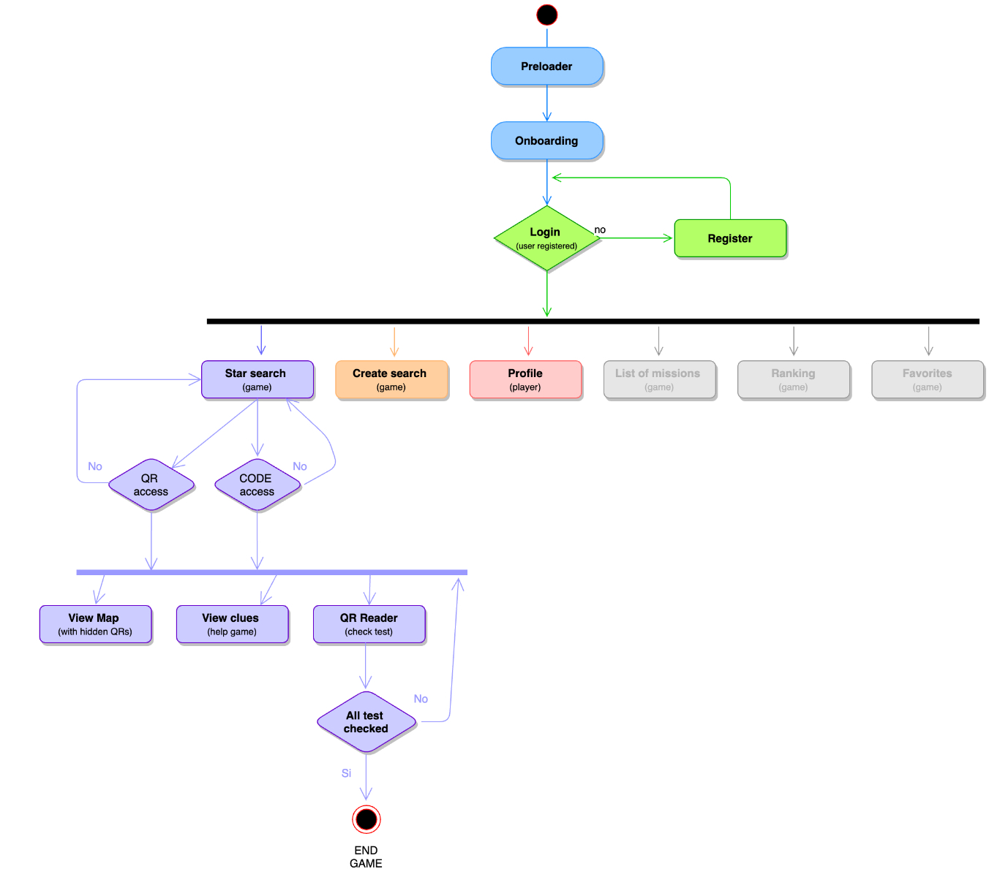
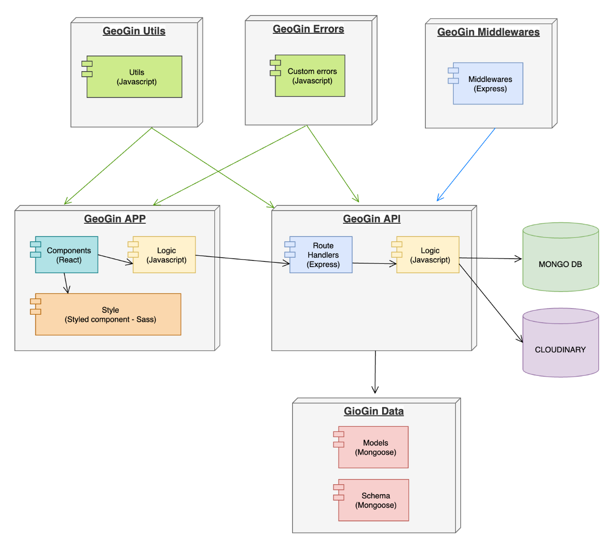
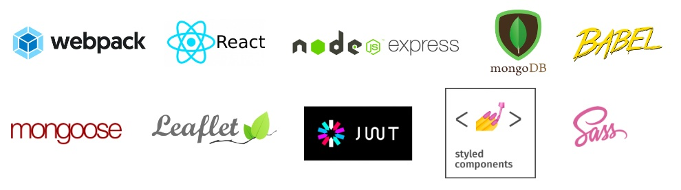

# 🕵️ GeoGin v0.0.0 🕵️

## 🔍 Description

Geogin is a "treasure hunt" style game but in this case what we will have to find are hidden QRs and through a non-exact location and a series of explanations and clues, we must be able to find them.

The game allows us to create new searches that we can later share with the Geogin community, and we will also have the possibility to participate in searches created by other players.

During the game there will be two roles, the "organizer", who will be the person in charge of creating the game and hiding the QRs in the established sites and the role of the "player"  participants in the search.

The game will take place in a specific period of time, which we can configure when creating the game and can be played both in teams or individually.

The winner will be the player who first finds all the hidden QRs or if the game ends earlier, the player who gets more points.

The player earns 10 points when overcome an stage and  losses 2 point when uses a clue.

## 🔍 Mockups

## Functional Description

### 🔍 Use Cases

### 🔍 Activities

## Technical Description

### 🔍 Blocks

## 🔍 Data modeling

### 🔍 Packages

#### React components

## 🔍 Technologies

