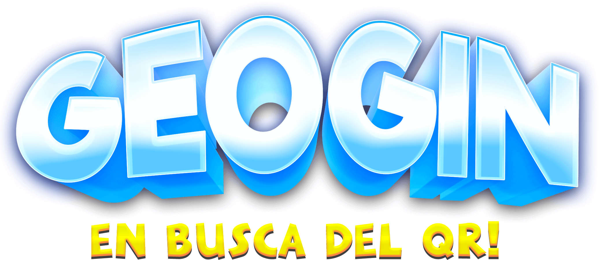
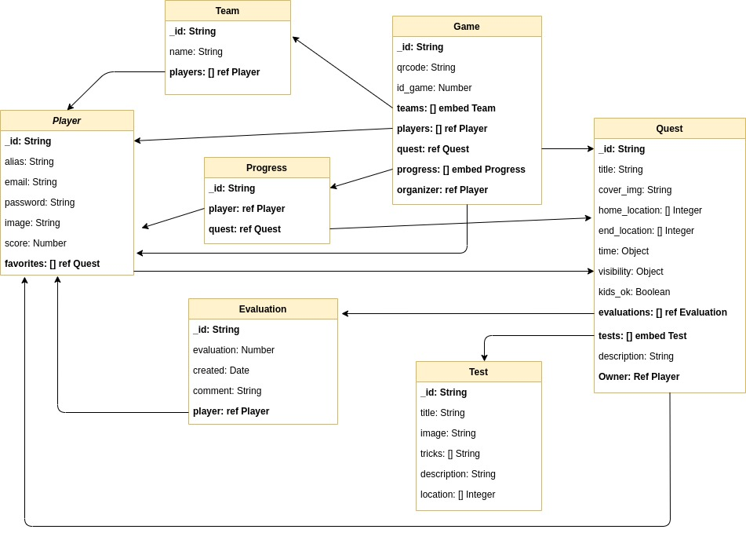

# 🕵️ GeoGin v0.0.0 🕵️

## 🔍 Description

Geogin is a "treasure hunt" style game but in this case what we will have to find are hidden QRs and through a non-exact location and a series of explanations and clues, we must be able to find them.

The game allows us to create new searches that we can later share with the Geogin community, and we will also have the possibility to participate in searches created by other players.

During the game there will be two roles, the "organizer", who will be the person in charge of creating the game and hiding the QRs in the established sites and the role of the "player" who will be the participants of the search.

The game will take place in a limited time, which we can configure when creating the search and can be played both by teams and individually.

The winner of the search will be the player who first finds all the hidden Qrs or if the game ends earlier in time, the player who will get the most points will have won.

For each test that we pass in the searches, the player thought 10 points and for each track that we use, 2 points will be deducted.

## 🔍 Mockups

## 🔍 Data modeling

