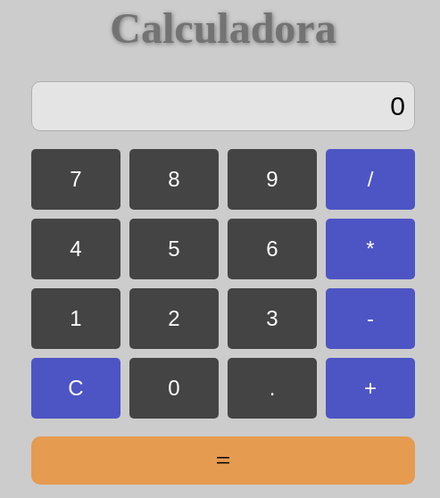

# Calulator App

## Intro

Calculator that allows you to do basic operations such as addition, rest, multiplication and division.

## How it works

Type a first operand, then select the operation you want to apply, and then select the second operand and click on equal to see the result

## Technical Description

Application made using html, css and javascript

## Resources

[Calculator wikipedia](https://en.wikipedia.org/wiki/Calculator)

