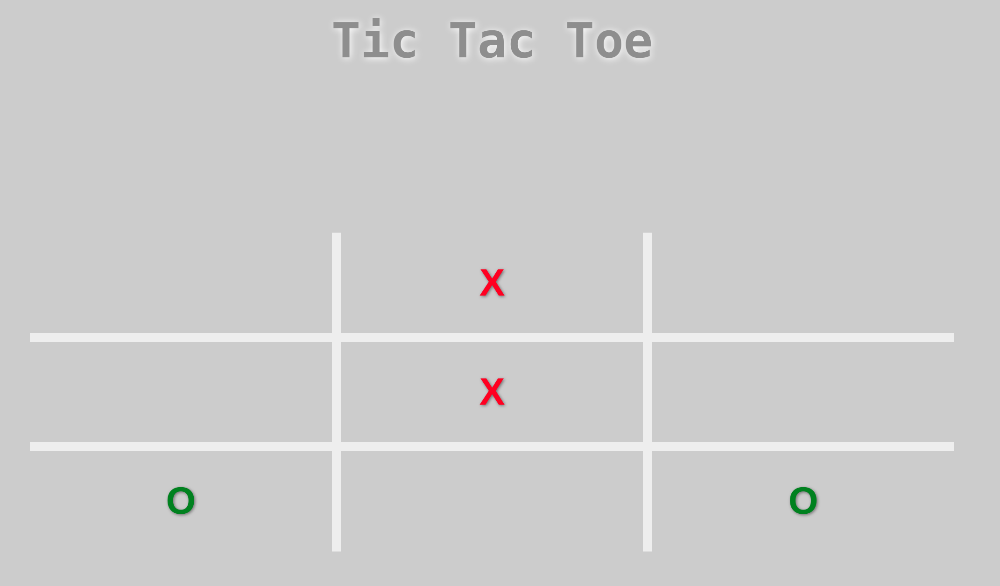

# Tic-tac-toe game

## Intro

Tic-tac-toe is a game that is traditionally played by being drawn on paper, and it can be played on a computer or on a variety of media.

## How it works

The goal of tic-tac-toe is to be the first player to get three in a row on a 3-by-3 grid or four in a row in a 4-by-4 grid. 

To start, one player draws a board, creating a grid of squares, usually 3-by-3 or 4-by-4.

In a 3-by-3 grid game, the player who is playing "X" always goes first. Players alternate placing Xs and Os on the board until either player has three in a row, horizontally, vertically, or diagonally or until all squares on the grid are filled. If a player is able to draw three Xs or three Os in a row, then that player wins. If all squares are filled and neither player has made a complete row of Xs or Os, then the game is a draw.

## Technical Description

Application made using html, css and javascript

## Resources

[Tic tac toe wikipedia](https://en.wikipedia.org/wiki/Tic-tac-toe)

